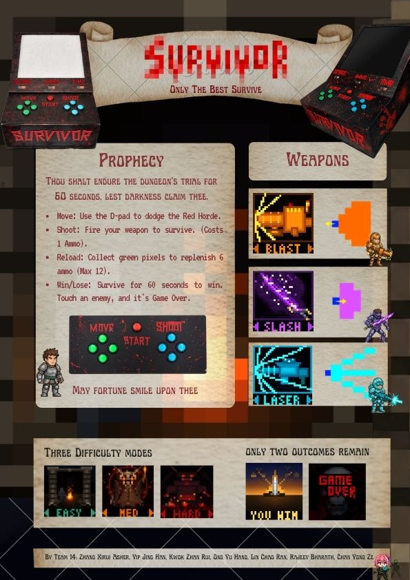

# 2026 50.002 1D Project: Survivor

---

## 🎮 Project Description

Introducing **Survivor**, a fast-paced, top-down survival shooter played on a $16\times16$ grid. The main objective is simple: survive for **60 seconds** by avoiding and eliminating endlessly spawning enemies (represented by red pixels) that chase you. 

The game heavily focuses on **resource management under pressure** and fast reflexes. 

### Core Game Mechanics:
* **Score System:** Players earn exactly **one point** for every enemy eliminated.
* **Ammunition Management:** Every attack consumes **1 ammo**. Players start fully stocked with a maximum capacity of **12 ammo**.
* **Resource Pickups:** To replenish stock, players must move to collect green ammo pickups scattered on the map, which grant **4 ammo** each. 
* **Dynamic Ammo Reminder:** To help the player during intense combat, the player's avatar (a blue pixel) slowly turns white as their ammunition approaches 0, warning them to find a pickup without looking away from the grid.
* **Difficulty Scaling:** To cater to all skill levels, the game features **Easy, Medium, and Hard** difficulties, which dynamically change the enemy spawn and movement rates.

### Weapon Loadouts:
Players can choose between three unique weapons before starting the game, each featuring custom movement and attack profiles:
1. **LASER:** Fires three straight cyan lines simultaneously to clear paths.
2. **BLAST:** Fires an orange cone-shaped blast and utilizes a recoil mechanic that pushes the player backward one tile.
3. **SLASH:** Fires a purple semi-circular close-range slash attack that lunges the player forward one tile.

---

## 🕹️ Gameplay

The game requires precision movement, timing, and strategic pathing to line up enemies for maximum elimination efficiency. Merging enemies only rewards one point, making crowd control vital. You lose instantly if an enemy comes into contact with your blue pixel, and you win by surviving the full 60-second countdown.

---

## Poster:

---

## 🛠️ Technologies Used

### Hardware Architecture
* **FPGA Board:** Alchitry Au FPGA (v1).
* **Display System:** Four 16x16 WS2812B addressable RGB LED matrices combined to form an upscaled **32x32 master display**.
* **User Interface:** Three 4-digit seven-segment displays explicitly mapped to output **Score, Ammo, and Time** counters in real-time.
* **Input Peripherals:** 9 momentary tactile push-buttons arranged into 1 Start button, 4 Move buttons (left side), and 4 Attack buttons (right side).
* **Power & Logistics:** Custom wooden and acrylic structural enclosure, a customized breadboard layout running 150 Ohm protection resistors, and a dedicated 5V power supply.

### Software Stack
* **Development Environment:** Alchitry Labs V2.
* **Hardware Description Language:** Lucid V2.

---

## 🧠 Memory Storage & Input Handling

Instead of relying on standard, slow memory-mapped I/O buffers, our architecture utilizes a highly optimized custom addressing scheme and register setup engineered straight into the hardware:

* **RAM Configuration:** Features a 512-slot single-port RAM running a 24-bit width. Slots `0-255` are dedicated to the active 16x16 game board graphics, while slots `256-511` act as a isolated **temporary enemy storage buffer** to prevent duplicate scanning artifacts during linear movement passes.
* **ROM Configuration:** A 9216-slot ROM handles static assets. It holds 24-bit RGB pixel data for the 9 distinct menu/game screens (1024 slots per frame) as well as the 10-bit vector offset arrays required for drawing custom weapon attack shapes.
* **REGFILE Setup:** Utilizes 8 discrete 10-bit registers (`R0` to `R7`). Dedicated entity registers explicitly store active player and ammo coordinates (`R0`/`R1`) to bypass full-map scanning latency, while hardware stat registers process game values directly for the seven-segment display drivers.
* **Hardware Downscaling Mux:** The custom WS2812B display driver reads RAM and ROM data natively. It features an internal serpentine index mapper alongside a hardware downscaler that clones a single logical 16x16 memory pixel across a physical 2x2 grid block on the larger 32x32 display matrix, maximizing visual clarity without costing performance.
* **Input Controller Priority:** Physical button actions are latched into asynchronous set-reset circuits within the Input Controller. The centralized Control Unit FSM samples these flags in a strict hierarchical order of priority (e.g., *Timer -> Move Enemy -> Spawn Enemy -> Player Actions*) to ensure no game ticks are missed and inputs are registered deterministically.

---

## 🧠 Datapath

---

## 🚀 Installation & Setup

> [!IMPORTANT]
> This project is written specifically in Lucid V2 for the Alchitry Au FPGA architecture. Without the specific physical hardware wiring schemas, LED matrices, and custom component arrays detailed in the *2026 50.002 Project Group Report Team 14.pdf*, it cannot be played or simulated traditionally.

1. Ensure you have **Alchitry Labs V2** installed on your workstation.
2. Open Alchitry Labs and import the root directory of this repository.
3. Compile the Lucid hardware source files to generate your bin file.
4. Flash the compiled architecture directly to your Alchitry Au board.

---

## 🤝 Acknowledgements

This project was built as part of the 50.002 Computation Structures curriculum by **No.1 DesignAI Team (Team 14)**:
* **Yip Jing Han:** Core gameplay loop architecture and Python terminal proof-of-concept modeling.
* **Chan Yong Ze:** Hardware design, enclosure assembly, and and I/O signal interfacing logic.
* **Kwok Zhan Rui:** Circuit design, wiring topologies, and physical prototyping layout.
* **Zhang Xirui Asher:** Project management, task coordination, and FSM integration logic.
* **Ong Yu Hang:** Architecture optimization, datapath efficiency modifications, and asset design.
* **Rajeev Bharath:** Gameplay balancing, refresh clock rates, and difficulty testing.
* **Lin Chao Ran:** Logistics procurement, storage management, and hardware assembly support.

Special thanks to the SUTD FabLab staff and instructor teams for their technical guidance throughout our construction process.