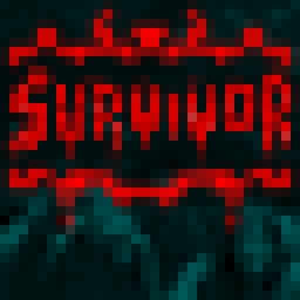
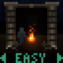
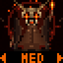
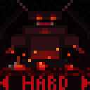
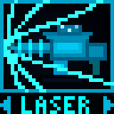
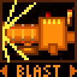
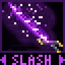

# 2026 50.002 1D Project
This project is written in Lucid V2 for Alchitry Au FPGA (v1). Open this project using Alchitry Labs V2.

### Background

**Survivor** is a top-down survival shooter where players must survive for 60 seconds by avoiding and eliminating endlessly spawning enemies that chase the player.

Enemies represented by red pixels continuously spawn at the edges of the 16x16 grid and move towards the player. The main objective is to survive for 60 seconds and win, by avoiding and eliminating enemies - you lose if an enemy comes into contact with you. The secondary objective is to get a high score by eliminating as many enemies as possible, as every enemy eliminated rewards one point. Players start fully stocked with the maximum of 12 ammo. Attacking requires ammo, so players must carefully manage their ammunition, which can only be replenished by collecting green ammo pickups that grant 4 ammo each.
The game features easy, medium, and hard difficulty, which changes the enemy spawn and movement rates to cater to different skill levels. 3 weapons are available: a laser weapon that fires straight 3 lines, a blast weapon that fires a large cone shape and pushes the player backwards, or a close-range semi-circular slash attack that moves the player forward.

### Hardware required
The machine requires 9 buttons (4 move buttons, 4 attack buttons and 1 start button), 3 4-digit seven-segment displays, and 4 16x16 WS2812B LED matrices.

  

  

